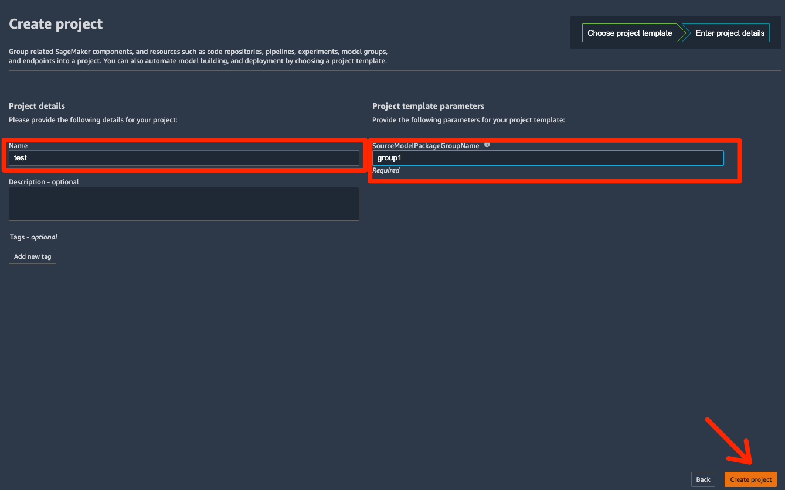
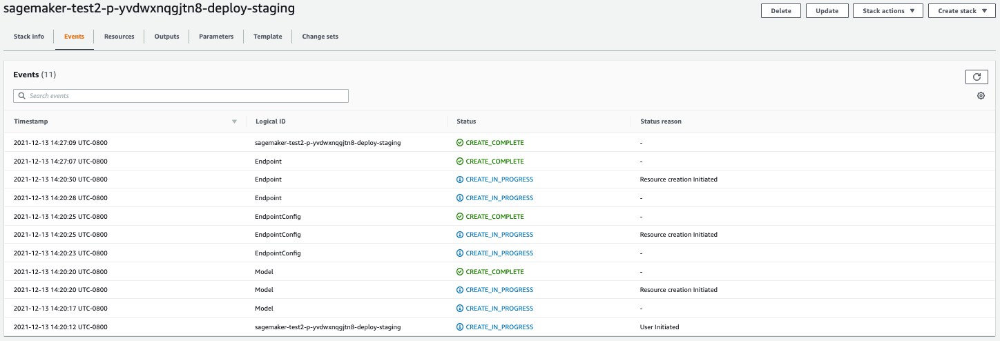

# Build a CD pipeline using your own model
In this post, building a CD pipeline using a model built locally (not on Amazon SageMaker) is described.

## Steps
### Model training and registration
`xgboost_BYOM_register.ipynb` shows first how to train an Xgboost model in scikit-learn and then inject it into Amazon SageMaker's first party XGboost container for scoring and then how to register the model. This addresses the usecase where a customer has already trained their model outside of Amazon SageMaker, but wishes to host it for predictions within Amazon SageMaker.

### Creating a CD pipeline using SageMaker Pipelines templates
In the following steps, creating a CD pipeline using a SageMaker Pipelines template, namely `MLOps template for model deployment`, is shown. One uses this template to automate the deployment of models in the Amazon SageMaker model registry to SageMaker Endpoints for real-time inference. The template provisions an __AWS CodeCommit__ repository with configuration files to specify the model deployment steps, __CloudFormation__ templates to define endpoints as infrastructure, and seed code for testing the endpoint. You can customize the template to suit your requirements or add more tests. __AWS CodePipeline__ is used to orchestrate the model deployment. Model building pipeline: None Code repository: __AWS CodeCommit__ Orchestration: __AWS CodePipeline__

1. From SageMaker Studio console, select Resources, and then select Projects. Then, select `Create Project`.

1. From the list of project templates, select `MLOps template for model deployment` and select `Select project template`.

1. Input name for the project and also the `SourceModelPackageGroupName` that you created in __Model training and registration__ section. Select `Create Project`.

1. After a few minutes, the project is created. You can choose to clone the created repository to your SagaMaker Stodio environment.

1. From search bar on the top of AWS Console, select __CodePipeline__. From the list of pipelines, select the name you created. You can see the steps in the CD pipeline laid out in the selected window.

1. The required resources, such as EndpointConfig and Endpoints, are created using a __CloudFormation__ template. To access the template, from search bar on the top of AWS Console, select __CloudFormation__. From the list of stacks, select the one that is created for you.

1. As part of CD pipeline, an endpoint is created.

1. Once the __CloudFormation__ template is done running, you can see the green sign indicating `Create_Complete`.

1. The endpioint is built but it is places in the staging environment. 

1. You can select to `Approve` or `Reject` the model based on its performance.
